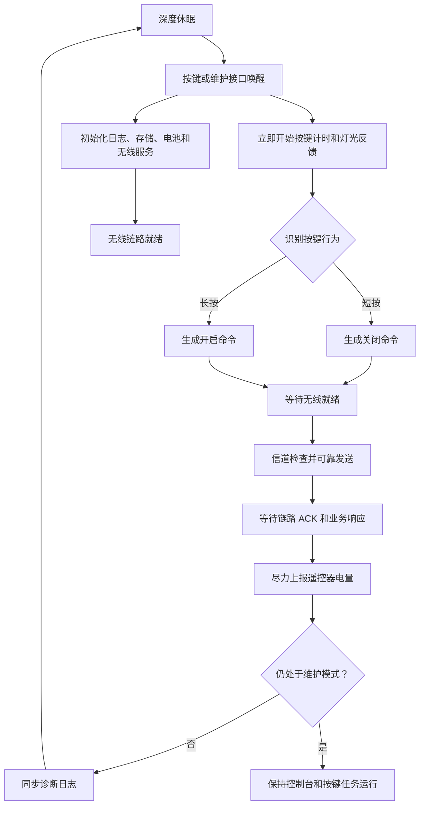
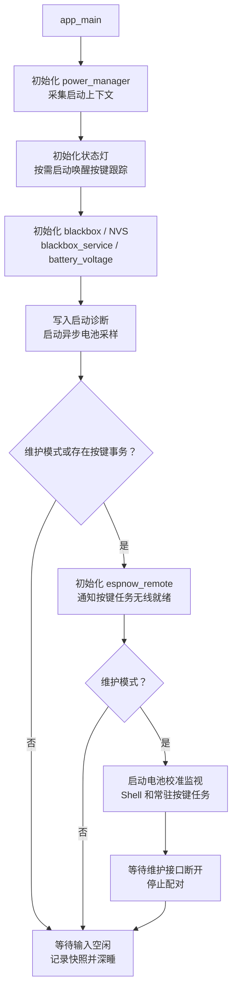
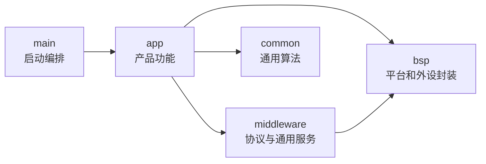

# Wireless Power Switch Button

`Wireless_power_switch_button` 是一个基于 ESP-IDF 的低功耗无线遥控开关固件，
默认与
[`Wireless_power_meter_lite`](https://github.com/qingmeijiupiao/Wireless_power_meter_lite)
配套使用。

它不仅演示“按键后发送一个无线数据包”，还实现了配对、可靠传输、信道恢复、
电池状态管理、深度休眠和故障日志等完整的软件流程。工程默认行为是短按关闭输出、
长按开启输出，但应用层和通信层已经分开，便于修改按键策略或接入其他控制目标。

> 本 README 主要介绍软件架构、运行流程和二次开发入口。具体引脚、电气连接和
> 板级注意事项属于 BSP 与对应组件的实现细节，不在根目录文档中展开。

## 主要功能

- **低功耗按键事务**：设备平时处于深度休眠，按键唤醒后完成识别、发送和反馈，
  输入空闲后重新休眠。
- **快速操作反馈**：按键识别和状态灯反馈不会等待全部存储、日志和无线模块初始化完成。
- **可靠无线控制**：在 ESP-NOW 之上实现 ACK、超时重传、重复包过滤和业务响应等待。
- **自动配对与信道恢复**：保存已配对设备和加密信息；通信信道变化后可扫描并恢复连接。
- **电池状态管理**：异步采样电池电压，估算显示电量，并支持板级电压校准。
- **运行诊断**：记录复位原因、唤醒来源、电量、无线事务和休眠前状态。
- **维护控制台**：在维护模式下提供配对、无线测试、电池状态和黑匣子命令。
- **自动构建与发布**：支持 CI 编译、标签发布、合并固件生成和浏览器在线烧录。

运行时日志、Shell 输出和黑匣子字符串统一使用 ASCII 英文，避免串口工具、
日志解析脚本或不同终端编码配置产生乱码。源码注释和开发文档使用中文。

## 默认运行流程

一次按键操作可以理解为一笔完整的“控制事务”：



这里的“可靠发送”包含两层确认：

1. **链路 ACK**：说明数据已经到达对端 ESP-NOW 链路。
2. **业务响应**：说明对端应用已经解析并处理了控制请求。

链路 ACK 成功不等于输出一定切换成功。例如功率计处于保护状态时，可以收到请求，
但业务层仍可能拒绝开启输出。

### 源码启动流程

`main/app_main.cpp` 保留组件初始化和运行模式分支，可直接查看固件会启动哪些功能。
复杂的格式化、异步回调和休眠收尾放在 `app_runtime`。



## 软件架构

工程采用 ESP-IDF Component 组织代码。每个 Component 是一个拥有独立公开接口、
源码、依赖声明和说明文档的模块。

```text
main/                         高层启动入口，仅展示主要启动阶段
components/
  app/                        与本产品行为直接相关的应用组件
    app_runtime/              启动上下文、诊断和休眠收尾工具
    button_input/             按键事务、长短按策略和操作反馈
    espnow_remote/            遥控端请求、响应等待和信道恢复
    espnow_service/           Wireless Power 产品业务协议
    battery_voltage/          电池电压采样与校准
    battery_level/            电量估算和显示约束
    power_manager/            唤醒来源和深度休眠管理
    status_led/               状态反馈
    blackbox_service/         应用日志捕获和持久化
    shell_command/            维护命令注册
  middleware/                 不直接决定产品交互的通用服务
    espnow_link/              ESP-NOW 可靠链路、配对和 peer 存储
    blackbox/                 结构化循环日志
  bsp/                        ESP-IDF 外设、存储和控制台封装
  common/                     与业务和硬件无关的通用算法
scripts/                      构建后固件合并脚本
```

总体依赖方向是：



这条规则的目的不是追求目录形式，而是限制依赖范围：

- `main` 明确展示组件初始化顺序、射频启用条件和运行模式分支，不实现工具细节。
- `app` 决定短按和长按分别做什么，以及如何反馈结果。
- `middleware` 负责可靠传输、配对和日志等可复用机制，不决定按键含义。
- `bsp` 封装 ESP-IDF 外设和平台接口，不依赖产品业务。

`espnow_service` 和 `espnow_link` 在遥控器与功率计仓库中分别维护。协议或链路发生
不兼容修改时，需要同时检查两端实现并进行联调；日常修改不要求两个仓库逐提交同步。

## 关键组件如何协作

### 按键与反馈

`button_input` 负责一次按键事务。它会尽早开始计时，避免 NVS、日志和无线初始化耗时
影响长短按判断。无线尚未就绪时，控制任务会等待 `notify_radio_ready()`，而不是丢弃
用户操作。

默认策略：

- 短按并释放：发送关闭请求。
- 按住达到长按阈值：立即发送开启请求，无需等待释放。
- 发送失败：使用不同的状态灯节奏提示。

### 产品协议与无线链路

无线功能分为三层：

| 层级 | 组件 | 负责内容 |
|------|------|----------|
| 遥控器应用 | `espnow_remote` | 查找目标、同步等待响应、信道恢复和诊断 |
| 产品协议 | `espnow_service` | 开关命令、数据读取、电量上报及字段编解码 |
| 可靠链路 | `espnow_link` | ESP-NOW 收发、ACK、重传、去重、配对和 peer 存储 |

这种划分可以避免按键代码直接处理数据帧，也可以避免可靠链路依赖某一种产品命令。

### 深度休眠

`power_manager` 统一判断唤醒来源并配置休眠入口。应用只有在以下工作完成后才会进入
深度休眠：

- 按键已经释放；
- 维护接口已经断开；
- 按键和无线事务已经结束；
- 电池采样与关键日志已经完成。

深度休眠会让程序从 `app_main()` 重新启动，因此需要跨休眠保留的数据不能只放在普通
RAM 中。本工程使用 RTC 保持内存保存短期电量状态，使用 NVS 保存配对和校准等长期配置。

### 黑匣子日志

普通串口日志在断电或深度休眠后会消失。`blackbox_service` 捕获重要运行日志并写入
Flash 循环分区，用于排查偶发唤醒、通信超时和电量异常。循环存储写满后会覆盖最旧记录，
不会持续增长。

`app_main` 调用 `app_runtime` 写入启动诊断和休眠快照。运行时消息只使用 ASCII
英文，保证串口输出与 Flash 中的日志可以由不同平台稳定解析。

## 二次开发入口

### 修改短按和长按行为

查看：

- `components/app/button_input/`
- `components/app/status_led/`

按键阈值、命令映射和反馈节奏目前属于产品应用策略。修改时不需要进入
`espnow_link`。

### 接入不同控制目标

如果仍使用当前 Wireless Power 协议，优先在
`components/app/espnow_remote/` 封装新的调用方式。

如果消息类型和数据字段都要改变，则修改：

- `components/app/espnow_service/`：业务消息和编解码；
- 对端工程中的对应业务协议实现；
- 必要时再扩展 Shell 测试命令。

只有需要改变 ACK、重传、配对或 peer 管理机制时，才应修改
`components/middleware/espnow_link/`。

### 移植到其他板卡

当前板级参数仍由相关组件内部定义。移植时重点检查：

- `power_manager`：唤醒输入、有效电平和休眠隔离策略；
- `button_input`：按键输入；
- `status_led`：反馈输出及有效电平；
- `battery_voltage`：ADC 通道、采样使能和电压换算；
- `sdkconfig` 与分区表：芯片能力、控制台和 Flash 布局。

建议先完成按键、状态灯和唤醒测试，再启用无线与电池功能，便于缩小问题范围。

### 添加维护命令

Shell 命令集中注册在 `components/app/shell_command/`。底层控制台初始化由
`components/bsp/shell/` 负责。产品命令应放在应用层，不应写入通用 Shell 组件。

## 组件文档

| 模块 | 文档 |
|------|------|
| 启动辅助工具 | [app_runtime](components/app/app_runtime/README.md) |
| 遥控端应用 | [espnow_remote 公共接口](components/app/espnow_remote/include/espnow_remote.h) |
| 产品业务协议 | [espnow_service](components/app/espnow_service/README.md) |
| ESP-NOW 链路 | [espnow_link](components/middleware/espnow_link/README.md) |
| 电池采样 | [battery_voltage](components/app/battery_voltage/README.md) |
| 电量估算 | [battery_level](components/app/battery_level/README.md) |
| 电源管理 | [power_manager](components/app/power_manager/README.md) |
| Shell 命令 | [shell_command](components/app/shell_command/README.md) |
| 黑匣子服务 | [blackbox_service](components/app/blackbox_service/README.md) |
| 黑匣子存储 | [blackbox](components/middleware/blackbox/README.md) |

## 构建

### 环境要求

- ESP-IDF v6.0+
- Python 3
- 目标芯片：ESP32-C3

```powershell
idf.py set-target esp32c3
idf.py build
```

构建完成后生成：

- `build/Wireless_power_switch_button.bin`：仅应用程序；
- `Wireless_power_switch_button_merged.bin`：Bootloader、分区表和应用程序合并固件。

## 烧录方式

### 仅更新应用程序

适用于 Bootloader 和分区表未变化的日常升级：

```powershell
esptool.py --chip esp32c3 write_flash 0x10000 build/Wireless_power_switch_button.bin
```

这种方式不会覆盖 NVS，已保存的配对、校准和业务配置会保留。

### 完整烧录

适用于首次安装、故障恢复或分区布局发生变化：

```powershell
esptool.py --chip esp32c3 write_flash 0x0 Wireless_power_switch_button_merged.bin
```

完整固件会覆盖 NVS 所在区域，因此配对和校准信息需要重新建立。合并范围不包含
`blackbox` 分区，但执行整片擦除会清除全部数据。

## 在线烧录与固件下载

ESP Launchpad 需要使用支持 Web Serial 的 Chromium 系浏览器。

| 入口 | 说明 |
|------|------|
| [APP 固件在线烧录](https://espressif.github.io/esp-launchpad/?flashConfigURL=https://cdn.jsdelivr.net/gh/qingmeijiupiao/Wireless_power_switch_button@firmware-dist/launchpad/latest.toml&app=Wireless_power_switch_button_app&exact=true) | 保留 NVS，适合常规升级 |
| [merged 固件在线烧录](https://espressif.github.io/esp-launchpad/?flashConfigURL=https://cdn.jsdelivr.net/gh/qingmeijiupiao/Wireless_power_switch_button@firmware-dist/launchpad/latest.toml&app=Wireless_power_switch_button_merged&exact=true) | 完整安装或恢复，会清除 NVS |

固定的最新固件地址：

- [最新 APP 固件](https://cdn.jsdelivr.net/gh/qingmeijiupiao/Wireless_power_switch_button@firmware-dist/latest/app.bin)
- [最新 merged 固件](https://cdn.jsdelivr.net/gh/qingmeijiupiao/Wireless_power_switch_button@firmware-dist/latest/merged.bin)
- [最新版本元数据](https://cdn.jsdelivr.net/gh/qingmeijiupiao/Wireless_power_switch_button@firmware-dist/last.toml)

不要把 APP 固件写入 `0x0`，也不要把 merged 固件写入 `0x10000`。

## 版本与发布

版本格式为 `MAJOR.MINOR.PATCH`：

- 开发者维护顶层 `CMakeLists.txt` 中的 `MAJOR` 和 `MINOR`；
- 本地构建使用 `PATCH=99`，表示非正式固件；
- 标签发布由 CI 使用 `PATCH=0` 构建，例如 `v0.2.0`；
- 编译时间统一按 UTC+8 写入固件。

推送或提交 PR 到 `main` 时，CI 会检查工程能否正常构建。推送发布标签后，CD 会生成
APP、merged、SHA256 校验文件和 Launchpad 配置，并更新 `firmware-dist` 分支。
