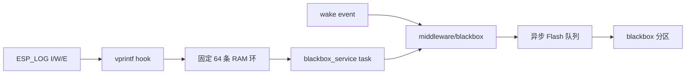

# blackbox_service

应用层黑匣子策略组件。在 `middleware/blackbox` 循环存储之上捕获
ESP-IDF 日志，并负责深睡前同步。

## 记录策略

- 捕获 `ESP_LOGI`、`ESP_LOGW`、`ESP_LOGE`。
- 所有记录均保存为字符串，不定义结构化日志协议。
- 落盘格式为 `[I][TAG] message`、`[W][TAG] message` 或 `[E][TAG] message`。
- 排除黑匣子内部 TAG，防止 Flash 写入日志递归捕获。
- 每次唤醒由 `app_main` 显式写入一条 `wake:` 记录。

唤醒记录包含：

```text
wake: source=<source> battery_mv=<mV> battery_result=<err>
      usb=<0|1> button=<0|1> firmware=<major.minor.patch> build=<time>
```

## 数据流



日志钩子只做格式化和 RAM 入环，不直接操作 Flash。后台任务每 20 ms
排空一次，避免日志调用链阻塞按键和无线任务。

## 深睡同步

`BlackboxService::sync()` 先排空 RAM 捕获环，再等待 middleware 写队列屏障。
`app_main` 在调用 `PowerManager::enter_deep_sleep()` 前执行该接口，确保短时
唤醒产生的日志已经落盘。

## API

```cpp
ESP_ERROR_CHECK(Blackbox::init());
ESP_ERROR_CHECK(BlackboxService::init());

BlackboxService::append_text_event("wake: source=button battery_mv=%d", battery_mv);
BlackboxService::sync();
```

## 约束

- 当前实现依赖 `CONFIG_LOG_VERSION_1=y`。
- 单条逻辑字符串最多 199 字符，超出部分由 middleware 截断。
- RAM 环满时新捕获日志会丢弃，业务日志调用不会等待 Flash。
- `sync()` 仅用于导出和休眠边界，不应放入按键实时反馈路径。

## 环境与依赖

| 类别 | 要求 |
|------|------|
| 框架 | ESP-IDF v6.0+ |
| 组件 | `blackbox`, `freertos`, `log` |
