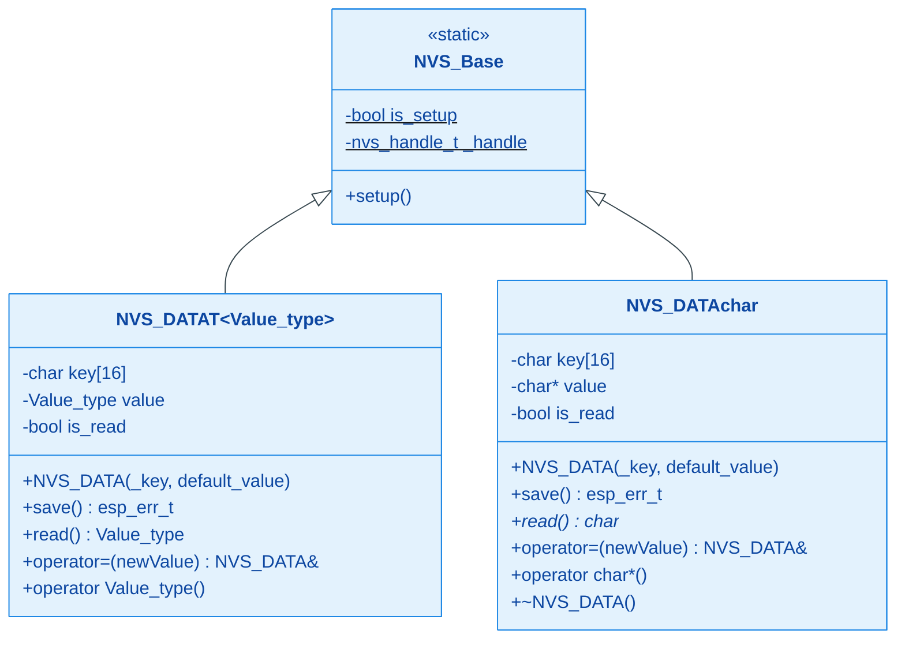
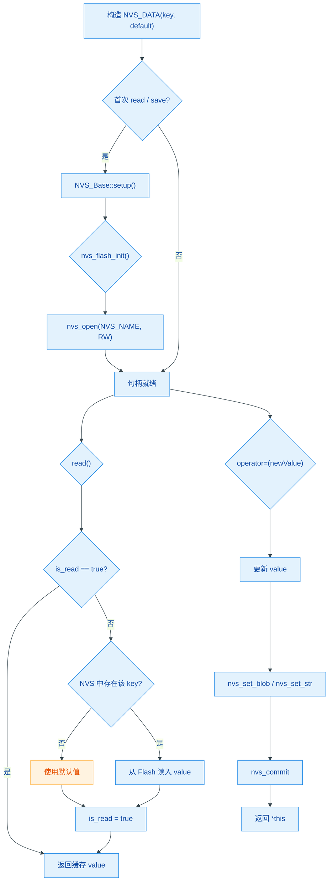

# HXC_NVS

基于 ESP-IDF NVS Flash 的 C++ 二次封装库，通过模板类 + 运算符重载实现持久化变量的声明即用，使 NVS 读写像普通变量赋值一样自然。

## 模块特点

- **模板泛型**：`NVS_DATA<T>` 支持任意可平凡拷贝的基础类型（`int`、`float`、`struct` 等），以 `nvs_set_blob` 统一存储
- **`char*` 特化**：对字符串类型单独特化，使用 `nvs_set_str` / `nvs_get_str`，内部深拷贝管理堆内存
- **错误可传递**：`setup()`、`set()` 和 `save()` 返回原始 `esp_err_t`
- **可靠提交**：`nvs_set_*` 和 `nvs_commit` 都成功后才更新 RAM 缓存
- **并发初始化**：原子完成标志和 FreeRTOS Mutex 防止重复初始化
- **兼容运算符**：保留 `operator=`，需要确认写入结果时应使用 `set()`
- **单次读取缓存**：`is_read` 标志避免重复访问 Flash，延长使用寿命
- **零指针安全**：`static_assert` 编译期禁止指针类型误用；key 超长自动截断并告警

## 环境与依赖

| 依赖项 | 版本要求 |
|--------|----------|
| ESP-IDF | v6.0+（依赖 `nvs_flash`、`esp_log` 组件） |
| C++ 标准 | C++11 及以上（`type_traits`、`static_assert`） |
| FreeRTOS | 随 ESP-IDF 附带 |

无额外硬件依赖，仅使用芯片内置 Flash。

## 架构与原理





## 集成与使用

### CMake 集成

组件已通过 `idf_component_register` 注册，在项目顶层 `CMakeLists.txt` 或 `main` 组件的 `REQUIRES` 中添加 `HXC_NVS` 即可。

### 基础类型

```cpp
#include "HXC_NVS.h"

HXC::NVS_DATA<int> boot_count("boot_cnt", 0);
HXC::NVS_DATA<float> calibration("cal_val", 1.0f);

void app_main() {
    // 读取：隐式转换，首次自动从 NVS 加载
    int cnt = boot_count;
    ESP_LOGI("APP", "boot count = %d", cnt);

    // 需要确认持久化结果时使用 set()
    ESP_ERROR_CHECK(boot_count.set(cnt + 1));
    ESP_ERROR_CHECK(calibration.set(1.05f));
}
```

### 字符串类型

```cpp
HXC::NVS_DATA<char*> device_name("dev_name", "default");

void app_main() {
    char* name = device_name;   // 读取
    device_name = "meter_01";   // 写入并持久化
}
```

### 自定义结构体

```cpp
struct Config {
    int mode;
    float threshold;
};

HXC::NVS_DATA<Config> cfg("cfg", {0, 3.3f});

void app_main() {
    Config c = cfg;        // 读取
    c.mode = 2;
    cfg = c;               // 写入
}
```

## API 参考

| 方法 / 运算符 | 说明 |
|---|---|
| `NVS_DATA(key, default)` | 构造，`key` 最长 15 字节，超长截断并 log error |
| `setup()` | 初始化 NVS Flash 并打开共享命名空间 |
| `set(newValue)` | 写入并 commit，成功后才更新缓存 |
| `save()` | 将当前 `value` 写入 NVS 并 commit |
| `read()` | 从 NVS 读取；若 key 不存在返回默认值；首次读取后缓存 |
| `operator=(newValue)` | 赋值并自动 `save()` |
| `operator T()` | 隐式转换，自动调用 `read()` |

| 宏 / 常量 | 说明 |
|---|---|
| `NVS_NAME` | 默认 NVS 命名空间名，定义为 `"HXC"` |

**注意事项**：

- 启动阶段应检查 `NVS_Base::setup()` 的返回值
- 配对、校准等关键配置应使用 `set()` 并检查返回值
- `char*` 特化版本内部通过 `new[]` / `delete[]` 管理堆内存，赋值操作会释放旧缓冲区
- 所有 `NVS_DATA` 实例共享同一 NVS 命名空间（`NVS_NAME`），不同实例通过 `key` 区分
