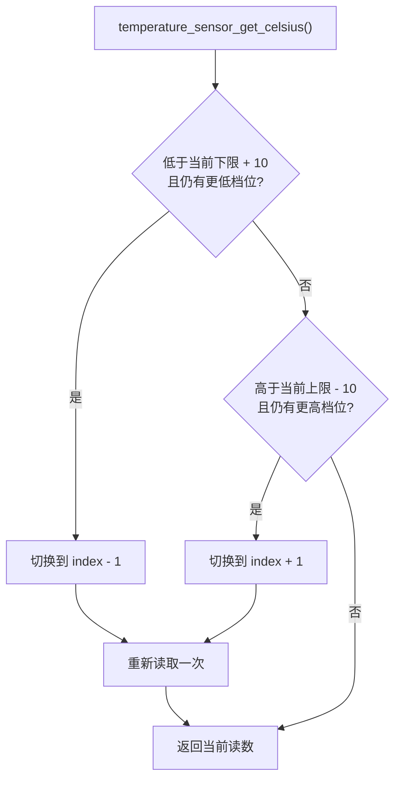

# ESP 芯片内温

### 为什么需要切换量程

ESP-IDF 为片内温度传感器提供多档可用范围。范围较宽时能覆盖更极端的温度，但精度较低；范围较窄时覆盖区间较小，但精度更高。

因此本组件默认从中间档位 `index = 2` 启动，并在温度靠近当前范围边缘 `10 摄氏度` 内时切换到相邻档位。这样既能覆盖温度变化，也尽量使用更合适的测量档位。

具体档位边界来自 ESP-IDF 的 `temperature_sensor_attributes`，不是本组件写死的常量。



切换档位时会依次 disable、uninstall、install、enable 传感器，然后重新读取一次温度。

### API

```cpp
#include "ESPChipTemperatureSensor.h"

ESPChipTemperatureSensor_t& chip_sensor = ESPChipTemperatureSensor_t::instance();
ESP_ERROR_CHECK(chip_sensor.init());
float chip_temp = chip_sensor.getTemperature(); // 摄氏度
```

### 注意事项

- 本 API 返回 `float` 摄氏度；写入 `global_state.chip_temperature` 时，`app_main` 会乘以 `100`。
- 初始化前调用会返回 `0` 并记录错误。
- 读取失败时返回最近一次读数。

## 环境与依赖

- 硬件：TMP235 连接 ADC 通道；ESP32-C3 片内温度传感器
- ESP-IDF v6.0+
- 组件依赖：`ADC`、`esp_driver_tsens`、`esp_hal_ana_conv`
