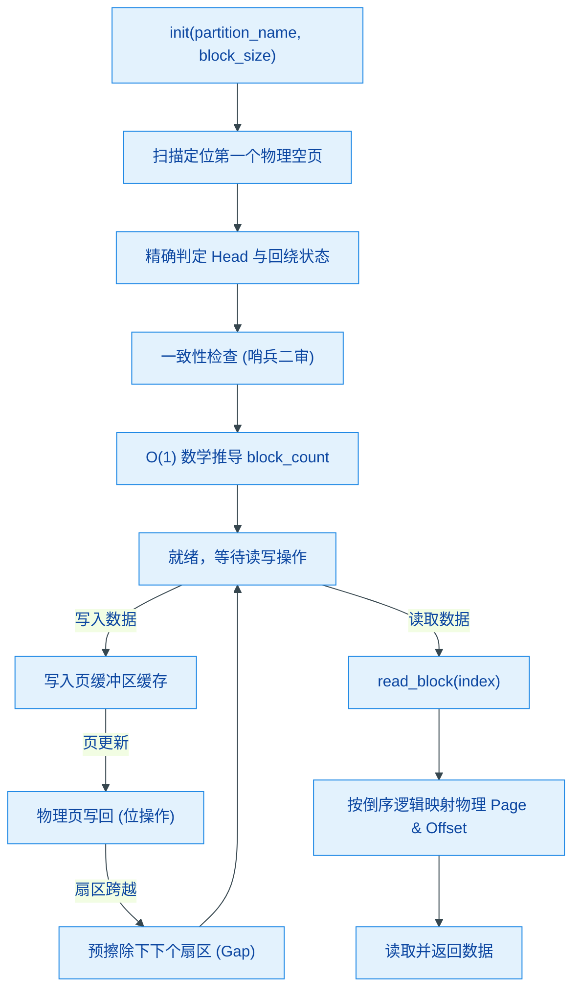

# circular_flash_buffer

基于 ESP32 SPI Flash 分区的通用循环缓冲区驱动，与具体数据结构无关。提供固定大小数据块的循环写入与倒序读取，专为高频写入、掉电安全和快速启动设计。

## 模块特点

- **数据结构无关**：以固定大小 `block` 为单位读写，不解析 payload 内容
- **快速启动恢复**：扫描页边界定位 Head，并利用 Head 指针位置推导 `block_count`
- **边界一致性自检**：引入 **Sentinel Sector (2号扇区哨兵)** 机制，识别并修复 `erase_all` 过程中掉电导致的数据异常
- **循环覆盖**：写满后自动回绕，始终保持写入头 (Head) 的下一个扇区为空（预擦除）
- **线程安全**：FreeRTOS 互斥锁保护读写、擦除、计数查询和启停操作
- **有效计数封顶**：预留一个空扇区用于提前擦除，可读条数不会超过仍保留在 Flash 中的记录数
- **掉电安全**：页内连续写入 Block 利用 Flash 物理特性，无需频繁擦除，保证数据完整性

## Flash 布局约定

| 参数 | 值 | 说明 |
|------|-----|------|
| `PAGE_SIZE` | 256 字节 | SPI Flash 页大小，硬件决定 |
| `SECTOR_SIZE` | 4096 字节 | SPI Flash 扇区大小，硬件决定 |
| `BLOCK_SOF` | 0xAA | 有效数据块首字节标识 |
| `block_size` | 由 `init()` 参数指定 | 每个数据块大小，必须整除 PAGE_SIZE |

## 架构与原理



### 写入流程

1. 数据拷贝到内存页缓冲区 `page_buffer`。
2. 立即将更新后的页写回 Flash（利用位从 1 变 0 特性，页内增量写无需擦除）。
3. 当页写满时切换下一页。
4. 每当进入新扇区，**预擦除下下个扇区**。这确保了环路中始终存在一个扇区大小的“空白间隙 (Gap)”，既能分摊写寿命，又作为启动定位标志。

### 启动恢复流程

1. **寻空**：线性扫描物理页，找到第一个全 `0xFF` 的空页。
2. **定头**：若 0 号页为空，检查最后两个扇区的第一页，区分全新分区、Head 位于
   最后一个扇区和 Head 已回到 0 号页；随后在目标扇区内定位具体页及块偏移。
3. **自检 (Consistency Check)**：如果 Head 处于物理开头但哨兵扇区 (Index 2) 异常为空，判定为 `erase_all` 中断，执行全区物理补擦。
4. **计数推导**：基于 Head 坐标和回绕状态计算有效 `block_count`。

## 集成与使用

```cpp
#include "circular_flash_buffer.h"

// 1. 初始化：使用 "blackbox" 分区，每条记录 32 字节
CircularFlashBuffer::init("blackbox", 32);

// 2. 写入一条数据（首字节必须为 BLOCK_SOF）
uint8_t data[32];
data[0] = CircularFlashBuffer::BLOCK_SOF;
// ... 填充数据 ...
CircularFlashBuffer::write_block(data);

// 3. 读取最新一条（index = 0 为最新，以此类推）
uint8_t buf[32];
CircularFlashBuffer::read_block(0, buf);

// 4. 获取总条数 (O(1) 复杂度)
uint32_t count = CircularFlashBuffer::get_count();

// 5. 彻底清空 (Factory Reset)
CircularFlashBuffer::erase_all();
```

## API 参考

### `esp_err_t init(const char* partition_name, size_t block_size)`
初始化驱动并恢复逻辑状态。

### `esp_err_t write_block(const uint8_t* data)`
写入一个块。跨越扇区时会自动执行预擦除以维持环路。

### `esp_err_t read_block(uint32_t index, uint8_t* data)`
读取指定索引的块。`index=0` 为物理意义上的最后一条（最新）记录。

### `esp_err_t erase_all()`
物理清空整个分区并重置所有内部管理指针与计数。

### `uint32_t get_count()`
返回当前存储的有效记录总数。

### `void set_enable(bool enable)`
动态启用/禁用写入操作。

## 环境与依赖

| 类别 | 要求 |
|------|------|
| 框架 | ESP-IDF v6.0+ |
| 硬件 | ESP32 系列，需在分区表中预留 DATA 分区 |

<!-- dependency-links:start -->
## 依赖导航

无工程内组件依赖；仅依赖 ESP-IDF 组件或 C/C++ 标准库。

> 本节按当前 `CMakeLists.txt` 的 `REQUIRES` / `PRIV_REQUIRES` 维护。
<!-- dependency-links:end -->
