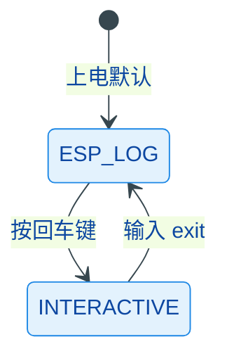

# shell

基于 ESP-IDF `esp_console` + `linenoise` 的交互式 Shell 框架，采用双模式状态机设计，在日志输出和交互命令行之间无缝切换。

## 模块特点

- **双模式状态机**：`ESP_LOG` 模式正常输出日志，按回车键切入 `INTERACTIVE` 模式运行命令
- **零侵入切换**：交互模式下关闭全局日志避免输出干扰，退出后自动恢复
- **单例模式**：全局唯一 `Shell` 实例，所有模块共享
- **C++ 命令封装**：`ShellCommand_t` 支持 `std::function`，可注册 lambda 作为命令处理函数
- **USB Serial JTAG**：默认使用 USB Serial JTAG 作为终端，兼容 ESP-IDF v6.0 使用的驱动 API，并保留旧版 API fallback

## 架构与原理



### 运行机制

1. **初始化**：配置 `esp_console`、`linenoise`、USB 驱动，创建 `listener_task`
2. **ESP_LOG 模式**：`listener_task` 以 `select()` 轮询 stdin，检测到回车后切为交互模式
3. **INTERACTIVE 模式**：`linenoise` 阻塞等待输入，执行命令后继续等待；输入 `exit` 切回日志模式

## 集成与使用

```cpp
#include "shell.h"

auto& shell = Shell::instance();
shell.init();

// 注册自定义命令
shell.register_command(ShellCommand_t("hello", "Print hello", "",
    [](int argc, char** argv) -> int {
        printf("Hello!\n");
        return 0;
    }));

// 注销命令
shell.deregister_command("hello");
```

## API 参考

### ShellCommand_t

| 成员 | 说明 |
|------|------|
| `ShellCommand_t(name, help, hint, func)` | 构造命令对象，`func` 为 `int(int, char**)` |
| `ShellCommand_t(name, help, hint, func_with_ctx, context)` | 构造带上下文的命令对象，`func_with_ctx` 为 `int(void*, int, char**)` |
| `name()` | 命令名称 |
| `help()` | 帮助文本（`help` 命令显示） |
| `hint()` | 参数提示（补全时显示） |
| `execute(argc, argv)` | 执行命令 |

### Shell

| API | 说明 |
|-----|------|
| `Shell::instance()` | 获取单例引用 |
| `init()` | 初始化 Shell（仅首次有效） |
| `register_command(cmd)` | 注册命令（需先 `init`） |
| `deregister_command(name)` | 注销命令 |
| `run_command(cmdline, ret)` | 编程式执行命令行 |
| `start_interactive()` | 切换到交互模式 |
| `stop_interactive()` | 切换回日志模式 |
| `get_mode()` | 获取当前模式 |
| `set_log_level(level)` | 设置日志级别 |
| `get_repl()` | 获取原始 REPL 句柄 |

## 内置命令

| 命令 | 说明 |
|------|------|
| `help` | 列出所有已注册命令 |
| `exit` | 退出交互模式，回到日志模式 |

## 可配置宏

| 宏 | 默认值 | 说明 |
|----|--------|------|
| `SHELL_TASK_STACK_SIZE` | 8192 | listener 任务栈大小 |
| `SHELL_TASK_PRIORITY` | 6 | listener 任务优先级 |

## 注意事项

- **命令输出必须使用 `printf`**：交互模式下 `ESP_LOG*` 被全局静默，命令实现中应使用 `printf` 输出
- **命令字符串生命周期**：`register_command` 内部会持有命令字符串指针直到 `deregister_command` 或 `esp_console_deinit`，无需外部手动管理
- **重复注册**：同名命令注册会返回 `ESP_ERR_INVALID_ARG` 并打印警告

## 环境与依赖

- **软件**：ESP-IDF v6.0+、C++11
- **组件依赖**：`console`、`esp_timer`、`vfs`、`esp_driver_usb_serial_jtag`、`freertos`、`esp_usb_cdc_rom_console`
