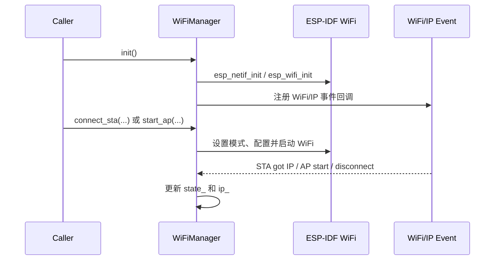

# wifi_manager

底层 WiFi 管理组件，封装 ESP-IDF WiFi、事件循环和 netif，提供 STA、AP、扫描、状态查询和常用参数配置能力。

## 模块定位

`wifi_manager` 是 BSP 层封装，只负责底层 WiFi 驱动和接口状态。应用侧的开机策略、NVS 凭据保存、AP 配网、DNS 劫持和 Web 联动由 `wifi_service` 负责。

## 模块特点

- **单例管理**：通过 `WiFiManager::instance()` 获取唯一实例
- **STA/AP/APSTA 模式切换**：支持连接外部 AP、启动本机 AP，或在 AP 配网时保留 STA 扫描能力
- **仅射频 STA 模式**：`start_sta_radio()` 为 ESP-NOW-only 场景启动 STA 接口但不连接 AP
- **驱动生命周期通知**：允许 ESP-NOW 等组件监听 WiFi 启停并同步恢复底层状态
- **同步等待能力**：STA 连接可选择阻塞等待连接结果
- **事件驱动状态**：通过 WiFi/IP 事件更新连接状态、IP 和扫描完成标志
- **AP 地址配置**：支持设置 AP 接口 IP，并同步重启 DHCP Server
- **ESP-IDF 能力透传**：封装扫描、省电、信道、带宽、协议、发射功率、国家码、AP STA 管理和 MAC 配置

## 状态模型

| 状态 | 说明 |
|------|------|
| `WIFI_STATE_DISCONNECTED` | 未连接或 WiFi 未启动 |
| `WIFI_STATE_STA_CONNECTED` | STA 已连接并获取 IP |
| `WIFI_STATE_AP_ACTIVE` | AP 已启动，可接受 STA 连接 |

## 基本流程



## 集成与使用

```cpp
#include "wifi_manager.h"

auto& wifi = WiFiManager::instance();
ESP_ERROR_CHECK(wifi.init());

ESP_ERROR_CHECK(wifi.connect_sta("ssid", "password", true));
IP_t ip = wifi.get_ip();

wifi.stop();
```

启动 AP：

```cpp
auto& wifi = WiFiManager::instance();
ESP_ERROR_CHECK(wifi.init());
ESP_ERROR_CHECK(wifi.start_ap("WPM-Lite", "", WIFI_AP_MAX_CONN, 1));
```

## API 参考

### 初始化与模式

| API | 说明 |
|-----|------|
| `WiFiManager::instance()` | 获取单例 |
| `init()` | 初始化 netif、事件循环、WiFi 驱动和事件组 |
| `deinit()` | 停止 WiFi 并释放资源 |
| `connect_sta(ssid, password, wait)` | STA 模式连接外部 AP |
| `start_sta_radio(channel)` | 仅启动 STA 射频并设置初始信道 |
| `start_ap(ssid, password, max_conn, channel)` | AP 模式启动热点 |
| `start_apsta(ssid, password, max_conn, channel)` | APSTA 模式启动热点，保留 STA 扫描能力 |
| `disconnect()` | 断开 STA 连接 |
| `stop()` | 停止 WiFi 驱动并清空状态 |

### 状态查询

| API | 说明 |
|-----|------|
| `get_state()` | 获取 `wifi_state_t` |
| `get_ip()` | 获取 STA IP |
| `get_ap_ip()` | 获取 AP 接口 IP |
| `get_mac(ifx)` | 获取指定接口 MAC |
| `get_rssi()` | 获取当前连接 AP 的 RSSI |
| `is_connected()` | 是否已 STA 连接 |
| `is_initialized()` | 是否已初始化 |
| `is_started()` | WiFi 驱动是否已经启动 |
| `register_radio_listener()` | 注册驱动启停监听器 |
| `unregister_radio_listener()` | 注销驱动启停监听器 |

### 扩展能力

| API | 说明 |
|-----|------|
| `scan_start()` / `scan_stop()` | 启动或停止扫描 |
| `scan_get_ap_num()` / `scan_get_ap_records()` | 获取扫描结果 |
| `set_power_save()` / `get_power_save()` | 设置或读取省电模式 |
| `set_channel()` / `get_channel()` | 设置或读取信道 |
| `set_bandwidth()` / `get_bandwidth()` | 设置或读取带宽 |
| `set_protocol()` / `get_protocol()` | 设置或读取协议位图 |
| `set_max_tx_power()` / `get_max_tx_power()` | 设置或读取最大发射功率 |
| `set_country()` / `get_country()` | 设置或读取国家/地区信息 |
| `ap_get_sta_list()` / `ap_deauth_sta()` | AP 模式 STA 管理 |
| `set_sta_config()` / `get_sta_config()` | 设置或读取 STA 配置 |
| `set_ap_config()` / `get_ap_config()` | 设置或读取 AP 配置 |
| `set_ap_ip()` | 设置 AP 接口 IP 与 DHCP 网段 |
| `set_mac()` | 设置指定接口 MAC |

## 注意事项

- 调用 `init()` 前需要完成 NVS 初始化，否则 ESP-IDF WiFi 初始化可能失败。
- `connect_sta(..., true)` 最多等待 `WIFI_CONNECT_TIMEOUT_MS`（当前为 30 秒），并在失败日志中区分 AP 关联失败与已关联但 DHCP 未分配 IP。
- 该组件不保存 SSID/password，也不负责 DNS Captive Portal；这些逻辑在 `wifi_service` 中维护。

## 环境与依赖

- **软件**：ESP-IDF v6.0+、FreeRTOS
- **组件依赖**：`esp_wifi`、`esp_netif`、`esp_event`、`lwip`
