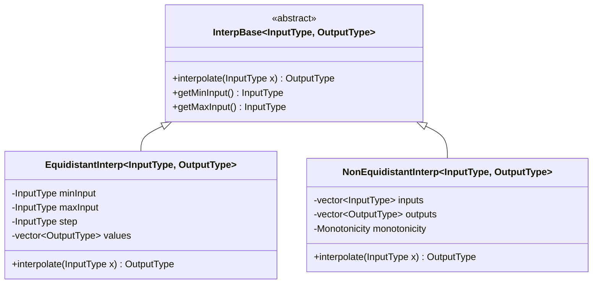
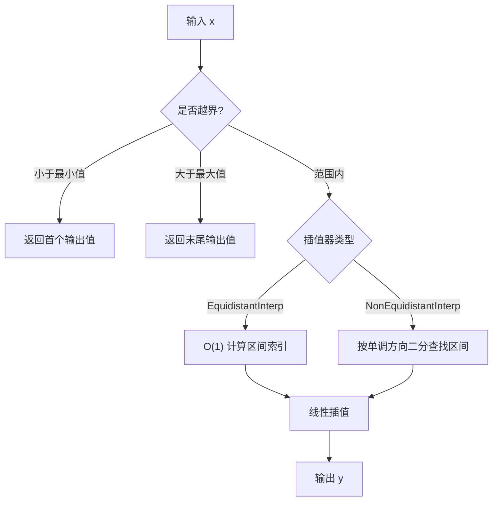

# Interp 库 - 高效插值算法模板库

## 概述

Interp 是一个面向嵌入式系统的 C++ 模板插值库，提供等间隔和不等间隔两种线性插值算法实现。设计为轻量级、高效且类型安全的解决方案，适用于 ESP32 等平台。

## 特性

- 模板化设计，支持任意数值类型（float, double, int 等）
- 自动单调性检测和边界处理
- 两种插值算法：
  - `EquidistantInterp`：等间隔插值，O(1) 索引计算
  - `NonEquidistantInterp`：不等间隔插值，O(log n) 二分查找
- 零动态内存分配的插值计算
- 输入范围验证和保护

## 类结构



## 插值流程



## 使用方法

### 基本使用

```cpp
#include "Interp.hpp"
```

### 等间隔插值

适用于输入数据等间距分布的场景，查找效率高。

```cpp
#include "Interp.hpp"

// 定义数据点 (x, y)，x 必须等间隔
std::vector<std::pair<float, float>> points = {
    {0.0f, 0.0f},
    {10.0f, 10.0f},
    {20.0f, 20.0f},
    {30.0f, 30.0f}
};

// 创建等间隔插值器
EquidistantInterp<float, float> interp(points);

// 插值计算
float result = interp.interpolate(15.0f);  // 返回 15.0f
float result2 = interp.interpolate(0.0f);  // 边界：返回 0.0f
float result3 = interp.interpolate(35.0f); // 超出范围：返回 30.0f

// 获取输入范围
float minInput = interp.getMinInput();  // 0.0f
float maxInput = interp.getMaxInput();  // 30.0f
```

### 不等间隔插值

适用于输入数据不等间距分布的场景。

```cpp
#include "Interp.hpp"

// 定义数据点 (x, y)，x 可以不等间隔
std::vector<std::pair<float, float>> points = {
    {0.0f, 0.0f},
    {5.0f, 12.5f},
    {15.0f, 37.5f},
    {30.0f, 90.0f}
};

// 创建不等间隔插值器
NonEquidistantInterp<float, float> interp(points);

// 插值计算
float result = interp.interpolate(10.0f);  // 返回 25.0f
```

### 使用基类指针

通过基类指针实现多态调用。

```cpp
InterpBase<float, float>* interp = new EquidistantInterp<float, float>(points);
float result = interp->interpolate(15.0f);
delete interp;
```

## API 参考

### 基类 InterpBase

```cpp
template<typename InputType, typename OutputType>
class InterpBase;
```

#### 枚举类型

```cpp
enum class Monotonicity {
    INCREASING,  // 递增
    DECREASING   // 递减
};
```

#### 纯虚方法

- `virtual OutputType interpolate(InputType x) const noexcept = 0` - 执行插值计算
- `virtual InputType getMinInput() const noexcept = 0` - 获取最小输入值
- `virtual InputType getMaxInput() const noexcept = 0` - 获取最大输入值

### 等间隔插值 EquidistantInterp

```cpp
template<typename InputType, typename OutputType>
class EquidistantInterp : public InterpBase<InputType, OutputType>;
```

#### 构造函数

```cpp
explicit EquidistantInterp(const std::vector<std::pair<InputType, OutputType>>& points) noexcept
```

- `points` - 二维点列表，至少需要 2 个点
- x 值必须等间隔

### 不等间隔插值 NonEquidistantInterp

```cpp
template<typename InputType, typename OutputType>
class NonEquidistantInterp : public InterpBase<InputType, OutputType>;
```

#### 构造函数

```cpp
explicit NonEquidistantInterp(const std::vector<std::pair<InputType, OutputType>>& points) noexcept
```

- `points` - 二维点列表，至少需要 2 个点
- x 值必须严格单调

### 递减序列示例

支持递减序列的自动检测和处理。

```cpp
// 创建递减序列的点
std::vector<std::pair<float, float>> points = {
    {100.0f, 0.0f},
    {80.0f,  10.0f},
    {60.0f,  20.0f},
    {40.0f,  30.0f}
};

NonEquidistantInterp<float, float> interp(points);

// 插值计算：自动处理递减序列
float result = interp.interpolate(75.0f);  // 结果为 12.5
```

## 设计特性

### 1. 边界处理
- **输入在范围内**：正常线性插值
- **输入小于最小值**：返回第一个输出值（clamp）
- **输入大于最大值**：返回最后一个输出值（clamp）

### 2. 单调性检测
- 自动检测序列是递增还是递减
- 支持两种不同类型的单调序列
- 确保二分查找的正确性

### 3. 性能优化
- **EquidistantInterp**：使用 O(1) 的索引公式，无查找开销
- **NonEquidistantInterp**：使用 O(log n) 的二分查找，适合大数据集

### 4. 类型安全
- 模板参数支持任意算术类型
- 编译期类型检查
- 避免运行时类型转换错误

## 性能对比

| 类型 | 时间复杂度 | 适用场景 |
|------|-----------|---------|
| EquidistantInterp | O(1) | 输入等间隔分布 |
| NonEquidistantInterp | O(log n) | 输入不等间隔分布 |

## 注意事项

1. 至少需要 2 个数据点才能创建插值器
2. 等间隔插值要求 x 值严格等间隔
3. 不等间隔插值要求 x 值严格单调（递增或递减）
4. 超出范围的输入会返回边界值（clamp）
5. 建议使用 `std::vector` 预分配内存以减少动态分配

## 使用场景

### 推荐使用 EquidistantInterp：
- 传感器校准表格（如温度-电压转换）
- 查找表实现
- 等间隔采样数据

### 推荐使用 NonEquidistantInterp：
- 非均匀采样数据
- 对数/指数标度的转换
- 任意分布的数据点

## 示例应用

### 温度传感器线性化
```cpp
// 热电偶电压-温度转换
std::vector<std::pair<float, float>> thermocouple_table = {
    {0.0f,   0.0f},
    {1.0f,  25.0f},
    {2.0f,  52.0f},
    {3.0f,  81.0f}
};

EquidistantInterp<float, float> temp_converter(thermocouple_table);
float voltage = read_thermocouple();
float temperature = temp_converter.interpolate(voltage);
```

### ADC 数字-物理转换
```cpp
// ADC raw value to physical value
std::vector<std::pair<int, float>> adc_calibration = {
    {0,   -10.0f},
    {512,   0.0f},
    {1023, 10.0f}
};

NonEquidistantInterp<int, float> adc_converter(adc_calibration);
int raw_value = read_adc();
float physical_value = adc_converter.interpolate(raw_value);
```

<!-- dependency-links:start -->
## 依赖导航

无工程内组件依赖；仅依赖 ESP-IDF 组件或 C/C++ 标准库。

> 本节按当前 `CMakeLists.txt` 的 `REQUIRES` / `PRIV_REQUIRES` 维护。
<!-- dependency-links:end -->
