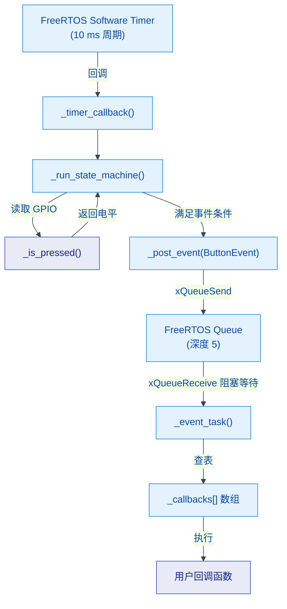
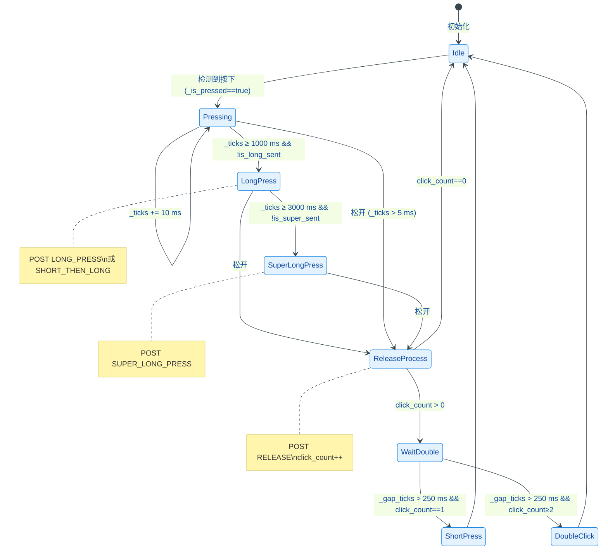

# Button

基于 FreeRTOS 定时器轮询 + 状态机的任务驱动型按键驱动模块，支持短按、双击、长按、超长按及短按后长按五类事件，回调在独立任务中执行，不阻塞扫描逻辑。

## 模块特点

- **状态机驱动**：单定时器轮询 + 集中状态机，逻辑内聚于 `_run_state_machine()`
- **异步回调模型**：事件通过 FreeRTOS Queue 投递至独立 Task，回调执行不阻塞扫描周期
- **零堆分配回调存储**：枚举下标直访数组替代 `std::map`，无动态内存分配
- **位域压缩状态**：`click_count` / `is_long_sent` / `is_super_sent` 共享 1 字节
- **消抖内置**：5 ms 消抖阈值，无需外部去抖电路
- **低活跃高电平/高活跃低电平均可配置**：构造时 `active_low` 参数切换

## 环境与依赖

| 类别 | 要求 |
|------|------|
| 框架 | ESP-IDF v6.0+ |
| RTOS | FreeRTOS（需支持 `xTimerCreate` / `xQueueCreate` / `xTaskCreate`） |
| 硬件 | ESP32 系列，至少 1 个可用 GPIO 输入引脚 |
| C++ 标准 | C++11 及以上（`std::function`、`constexpr`） |
| 组件依赖 | `esp_driver_gpio` |

## 架构与原理





### 状态判定时序

| 时序场景 | _ticks 范围 | 产出事件 |
|----------|------------|---------|
| 短按松开 → 空闲 250 ms | _ticks ≤ 1000 ms | `SHORT_PRESS` |
| 连续两次短按 → 空闲 250 ms | 各次 _ticks ≤ 1000 ms | `DOUBLE_CLICK` |
| 持续按下 ≥ 1000 ms | _ticks ≥ 1000 ms | `LONG_PRESS`（或 `SHORT_THEN_LONG`）|
| 持续按下 ≥ 3000 ms | _ticks ≥ 3000 ms | `SUPER_LONG_PRESS` |
| 任意时刻松开 | _ticks > 5 ms | `RELEASE` |

## 集成与使用

```cpp
#include "Button.h"

// 1. 实例化
Button btn;

// 2. 绑定事件回调
btn.bind_event(ButtonEvent::SHORT_PRESS, []() {
    printf("短按触发\n");
});
btn.bind_event(ButtonEvent::DOUBLE_CLICK, []() {
    printf("双击触发\n");
});
btn.bind_event(ButtonEvent::LONG_PRESS, []() {
    printf("长按触发\n");
});
btn.bind_event(ButtonEvent::SUPER_LONG_PRESS, []() {
    printf("超长按触发\n");
});
btn.bind_event(ButtonEvent::SHORT_THEN_LONG, []() {
    printf("短按后长按触发\n");
});
btn.bind_event(ButtonEvent::RELEASE, []() {
    printf("按键松开\n");
});

// 3. 启动驱动：GPIO0, 低电平有效 (默认)
btn.setup(GPIO_NUM_0);

// 4. 运行期间可动态解绑
// btn.unbind_event(ButtonEvent::DOUBLE_CLICK);

// 5. 作用域结束自动析构：停止定时器、删除任务与队列
```

## API 参考

### `Button()`

默认构造按键对象，此时不绑定 GPIO。

### `esp_err_t setup(gpio_num_t gpio_num, bool active_low = true)`

初始化 GPIO 并启动按键驱动。`active_low=true` 时启用内部上拉，按下为低电平；`active_low=false` 时启用内部下拉，按下为高电平。创建事件队列（深度 5）、事件处理任务（优先级 3，栈 4096 字节）及 10 ms 轮询定时器并启动。返回 `ESP_OK` 或 `ESP_ERR_NO_MEM`。

### `void bind_event(ButtonEvent event, ButtonCallback cb)`

绑定指定事件类型的回调函数，覆盖同一事件的已有回调。

### `void unbind_event(ButtonEvent event)`

移除指定事件类型的回调，设为 `nullptr`。

### `ButtonEvent` 枚举

| 值 | 含义 | 触发条件 |
|----|------|---------|
| `SHORT_PRESS` | 短按 | 1 次有效点击后空闲超 250 ms |
| `DOUBLE_CLICK` | 双击 | ≥2 次有效点击后空闲超 250 ms |
| `LONG_PRESS` | 长按 | 持续按下 ≥ 1000 ms |
| `SUPER_LONG_PRESS` | 超长按 | 持续按下 ≥ 3000 ms |
| `SHORT_THEN_LONG` | 短按后长按 | 短按释放后再次按下并持续 ≥ 1000 ms |
| `RELEASE` | 松开 | 任意有效按压释放瞬间 |

### 可调阈值常量

| 常量 | 默认值 | 说明 |
|------|-------|------|
| `BTN_DEBOUNCE_MS` | 5 | 消抖时间 |
| `BTN_LONG_MS` | 1000 | 长按判定阈值 |
| `BTN_SUPER_LONG_MS` | 3000 | 超长按判定阈值 |
| `BTN_DOUBLE_CLICK_MS` | 250 | 双击间隔判定阈值 |
| `BTN_SCAN_TICK_MS` | 10 | 定时器轮询周期 |
