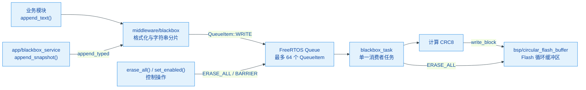
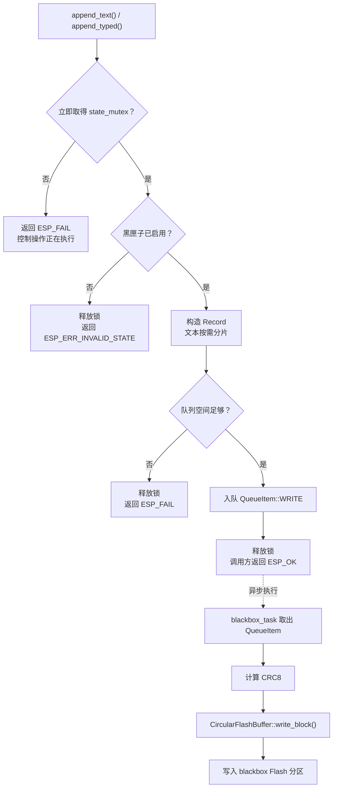
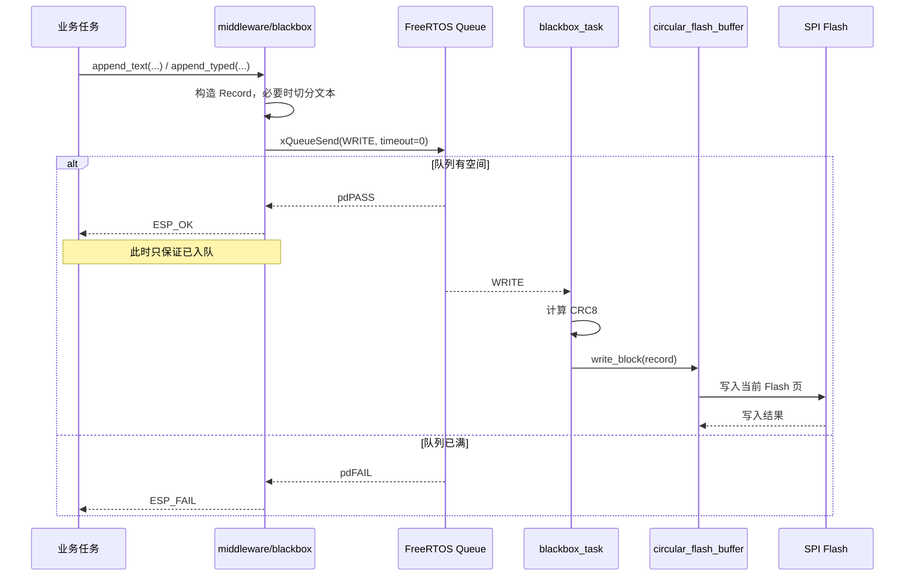
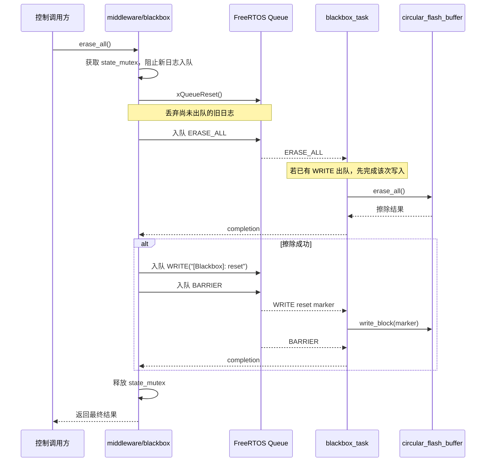
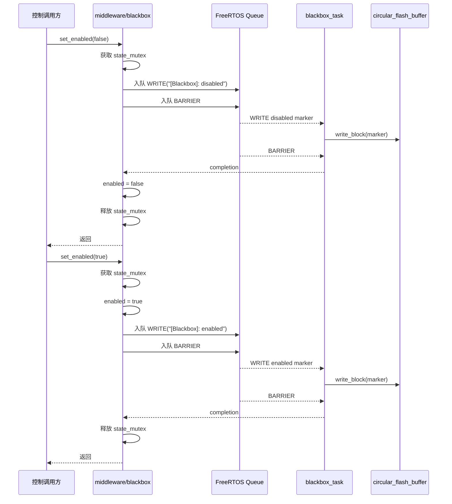

# Blackbox

黑匣子日志系统中间件，支持字符串日志与类型化数据日志，与具体业务数据结构解耦。底层使用 `circular_flash_buffer` 实现循环存储，上层由 `blackbox_service`（app 层）定义具体的结构化数据格式。

## 模块特点

- **数据结构解耦**：middleware 层只定义通用帧头和 payload 容器，不依赖具体业务结构
- **字符串自动切分**：超过 payload 长度的字符串自动拆分为多条 STRING 记录，最多 8 条（共 199 字符）
- **字符串自动拼接**：`read_text()` 自动还原多条 STRING 分片，并返回占用的原始记录数
- **类型化数据接口**：`append_typed()` 提供二进制 payload 写入，由上层定义具体结构
- **CRC8 校验**：每条记录末尾附加 CRC8 校验码，读取时自动验证完整性
- **异步串行落盘**：普通记录、清空操作和同步屏障通过同一消费者任务执行，避免擦除与在途写入竞争
- **LogType 可扩展**：枚举类型，当前支持 `STRING` 和 `STRUCTURED`，可按需扩展

## 数据帧格式

每条记录 **32 字节**，布局如下：

| 偏移 | 长度 | 字段 | 说明 |
|------|------|------|------|
| 0 | 1 | sof | 帧头，固定为 0xAA |
| 1 | 1 | type | 日志类型，参见 `LogType` 枚举 |
| 2 | 4 | timestamp | 毫秒时间戳 |
| 6 | 25 | payload | 数据负载（联合体：`.bytes` / `.str`） |
| 31 | 1 | crc_checksum | CRC8 校验码 |

### 字符串日志切分规则

- `len < 25`：单条 STRING，payload 末尾有 `\0`
- `len ≥ 25`：拆分为多条 STRING，非末尾片段 payload 无 `\0`（通过此特征判断是否有续条），末尾片段有 `\0`
- 最多拆分 8 条，超长字符串截断到 199 字符
- 同一条字符串的所有分片使用相同时间戳；队列空间不足时整条拒绝，避免落盘不完整分片

### LogType 枚举

| 值 | 名称 | 说明 |
|----|------|------|
| 0 | `STRING` | 字符串日志 |
| 1 | `STRUCTURED` | 结构化数据日志（由 app 层定义 payload 格式） |

## 架构与层级关系



- **bsp/circular_flash_buffer**：Flash 循环读写，与数据结构无关
- **middleware/blackbox**：通用帧格式、CRC 校验、字符串分片和异步写入队列，不依赖具体业务结构
- **app/blackbox_service**：定义版本化业务快照和应用层记录策略，调用 `append_typed()`

## 异步写入流程

普通日志调用只负责构造记录并放入 FreeRTOS 队列，不直接等待 Flash 写入完成。独立任务
`blackbox_task` 按入队顺序串行执行物理操作，因此业务任务不会被 Flash 写入延迟阻塞。



注意：

- `append_text()` 和 `append_typed()` 返回 `ESP_OK` 表示记录已成功入队，不表示已经写入 Flash。
- 需要等待此前记录处理完成时调用 `sync()`。该接口主要用于低频控制、测试和导出前同步。
- 队列满时普通日志立即返回 `ESP_FAIL`，不会阻塞保护任务等实时调用方。
- 长文本日志会先检查队列剩余空间。空间不足时整条拒绝，不会只写入部分分片。
- `count()`、`read()` 和 `read_text()` 只读取已经落盘的记录，不包含仍在队列中的记录。

### 普通日志时序



## 控制操作流程

`erase_all()` 和 `set_enabled()` 属于低频控制操作。它们会取得 `state_mutex`，阻止新日志入队，
并通过同一个消费者任务执行控制消息。`BARRIER` 是同步屏障：消费者处理到屏障时，屏障之前
的所有消息均已执行完成。

### 清空日志时序



### 启停日志时序



## 集成与使用

```cpp
#include "blackbox.h"

// 初始化（在 app_main 中调用一次）
Blackbox::init();

// 写入字符串日志（支持 printf 格式，自动分片）
Blackbox::append_text("Voltage: %dmV", 12000);
Blackbox::append_text("Over current protection triggered at %duA", 2500000);

// 读取日志
uint32_t count = Blackbox::count();
Blackbox::Record raw = Blackbox::read(0); // 0 = 最新

if (raw.header.type == Blackbox::LogType::STRING) {
    printf("日志: %s\n", raw.payload.str);
} else if (raw.header.type == Blackbox::LogType::STRUCTURED) {
    // 由 app 层解读 payload.bytes
}

// 批量读取时暂停写入
Blackbox::set_enabled(false);
for (uint32_t i = 0; i < count; i++) {
    auto entry = Blackbox::read(i);
    // ...
}
Blackbox::set_enabled(true);
```

### 读取自动拼接的字符串日志

`read_text(index)` 自动拼接被拆分的字符串日志，并返回本次读取占用的原始记录数。
传入的索引必须指向该字符串日志最新的一条记录。批量读取按从新到旧的顺序轮询时，
每次将索引增加 `record_count`：

```cpp
for (uint32_t index = 0; index < Blackbox::count();) {
    auto text = Blackbox::read_text(index);
    if (text.record_count != 0) {
        printf("%s\n", text.str);
        index += text.record_count;
        continue;
    }

    auto raw = Blackbox::read(index);
    // 处理非字符串记录
    ++index;
}
```

记录无效、记录不是字符串类型，或索引指向非末尾字符串分片时，
`read_text()` 返回的 `record_count` 为 `0`。

## API 参考

### `esp_err_t init()`

初始化黑匣子，内部调用 `CircularFlashBuffer::init()` 恢复写入位置。在 `app_main` 中调用一次。

### `esp_err_t append_text(const char *fmt, ...)`

异步写入字符串日志，支持 printf 格式化。自动分片（最多 8 条），超长截断。
返回 `ESP_OK` 表示所有分片已经入队，不表示已经落盘。

### `esp_err_t append_typed(LogType type, const uint8_t* payload, size_t len)`

异步写入类型化二进制数据，由上层（如 `blackbox_service`）调用。`len` 不得超过
`PAYLOAD_SIZE`。返回 `ESP_OK` 表示记录已经入队，不表示已经落盘。

### `esp_err_t sync()`

同步等待此前已经入队的记录处理完成。内部向消费者队列加入 `BARRIER` 并等待屏障完成。
普通实时日志无需调用；导出、测试或需要稳定读取边界时可以使用。

### `uint32_t count()`

返回已写入的日志总条数（含分片条目）。

### `Record read(uint32_t index)`

按倒序读取指定索引的日志原始数据，`index=0` 为最新。自动验证 SOF 和 CRC8，校验失败返回全零。

### `TextRecord read_text(uint32_t index)`

按倒序索引读取字符串日志并自动拼接分片，`index` 必须指向字符串日志最新的一条记录。
返回值中的 `str` 为以 `\0` 结尾的完整字符串，`record_count` 为本次读取占用的原始记录数。
读取失败时 `record_count` 为 `0`。批量读取时应使用 `record_count` 跳过已经拼接的分片。

### `esp_err_t erase_all()`

同步清空黑匣子。调用期间阻止新日志入队，丢弃尚未出队的旧记录，并等待消费者任务完成物理擦除。
擦除成功后写入一条 `"[Blackbox]: reset"` 标记，并通过同步屏障等待消费者处理完成。

### `void set_enabled(bool enable)`

同步启用或禁用日志写入。状态变更标记会在函数返回前由消费者处理完成。
由于接口返回类型为 `void`，标记记录的 Flash 硬件写入错误不会返回给调用方。

## 性能测试结果

以下结果为单条记录大小为 **32 B** 时的实测数据，用于评估 Flash 写入、异步队列和循环回绕行为。

### 基础场景

| 场景 | 平均写入耗时 | 墙钟吞吐率 |
|------|-------------:|-----------:|
| 单条 32 B | 395 us | 76 KiB/s |
| 跨页 8+1 条 | 346 us/条 | 89 KiB/s |
| 跨扇区 128+1 条 | 373 us/条 | 75 KiB/s |

| 其他指标 | 结果 |
|----------|-----:|
| 底层整分区擦除 | 91.2-117.2 ms |
| 中间件同步擦除 | 137.2-177.1 ms |
| 倒序读取 | 67-71 us/次 |
| 异步队列压力 | 512 次尝试中接受 64 条、拒绝 448 条 |
| 排空 64 条队列 | 31.4 ms，约 490 us/条 |

测试结果表明：

- 跨页写入没有明显性能惩罚。
- 跨扇区场景包含预擦除，平均写入耗时仍保持稳定。
- 中间件同步擦除比底层整分区擦除多约 20-60 ms，包含 reset 标记异步写入和屏障等待成本。
- 队列满时立即拒绝新记录，实时任务不会因日志落盘阻塞。
- 长文本在队列空间不足时整条拒绝，不会产生不完整的分片记录。

### 回绕压力

| 指标 | 结果 |
|------|-----:|
| 总写入记录 | 45,073 条 |
| 回绕后保留记录 | 44,817 条 |
| 单条记录 | 32 B |
| 总墙钟耗时 | 18.825 s |
| Flash API 活跃耗时 | 17.006 s |
| 平均写入耗时 | 377 us/条 |
| 墙钟吞吐率 | 74 KiB/s |
| 主动调度让步 | 2,817 次 |
| 回绕后倒序读取 | 123 us/次 |

回绕压力测试覆盖了循环缓冲区写满后的覆盖写入路径。结果显示，预擦除和回绕覆盖没有显著降低持续写入吞吐率；回绕后的倒序读取耗时为 123 us/次。

## 环境与依赖

| 类别 | 要求 |
|------|------|
| 框架 | ESP-IDF v6.0+ |
| RTOS | FreeRTOS |
| 组件依赖 | `circular_flash_buffer`, `esp_timer`, `log` |
