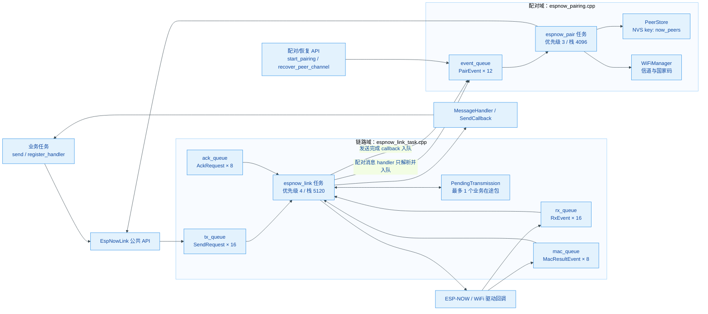
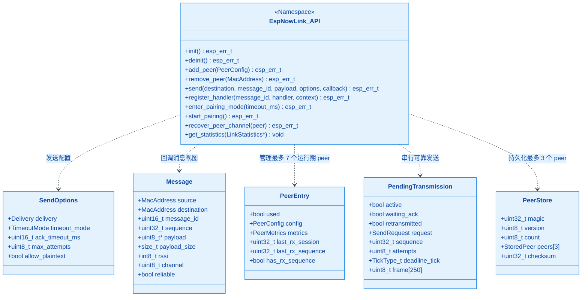
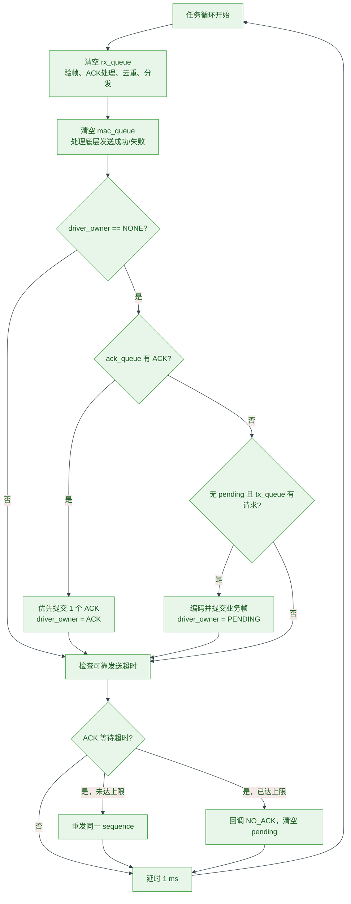
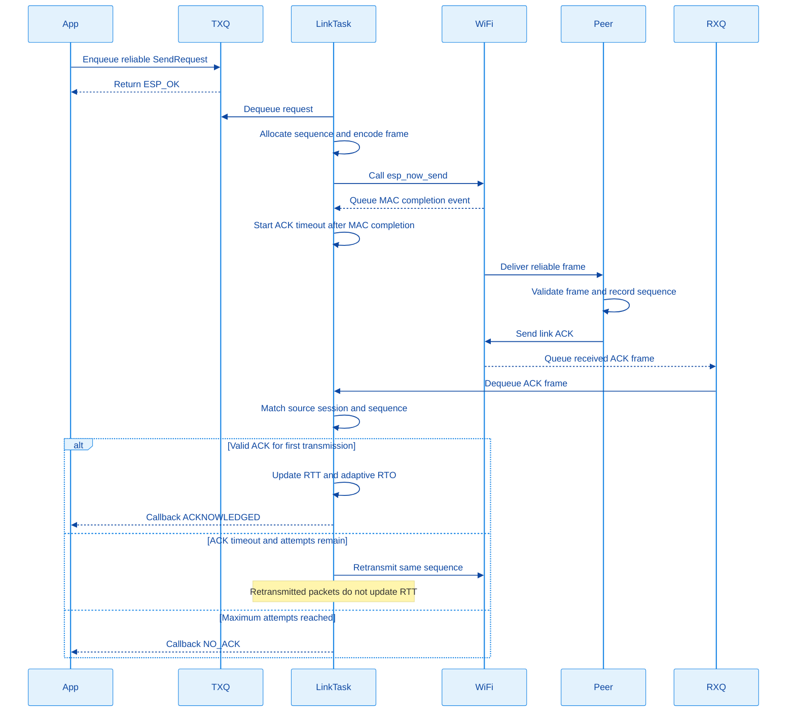
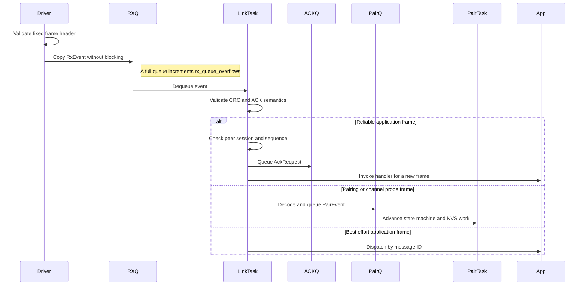
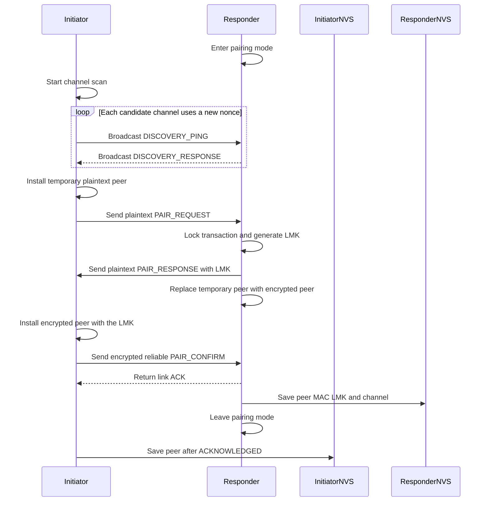
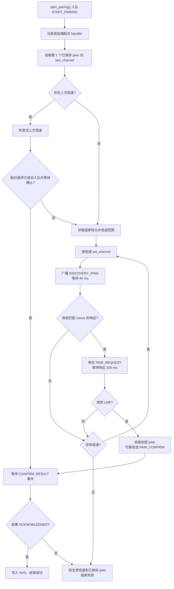
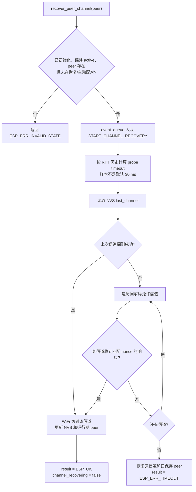
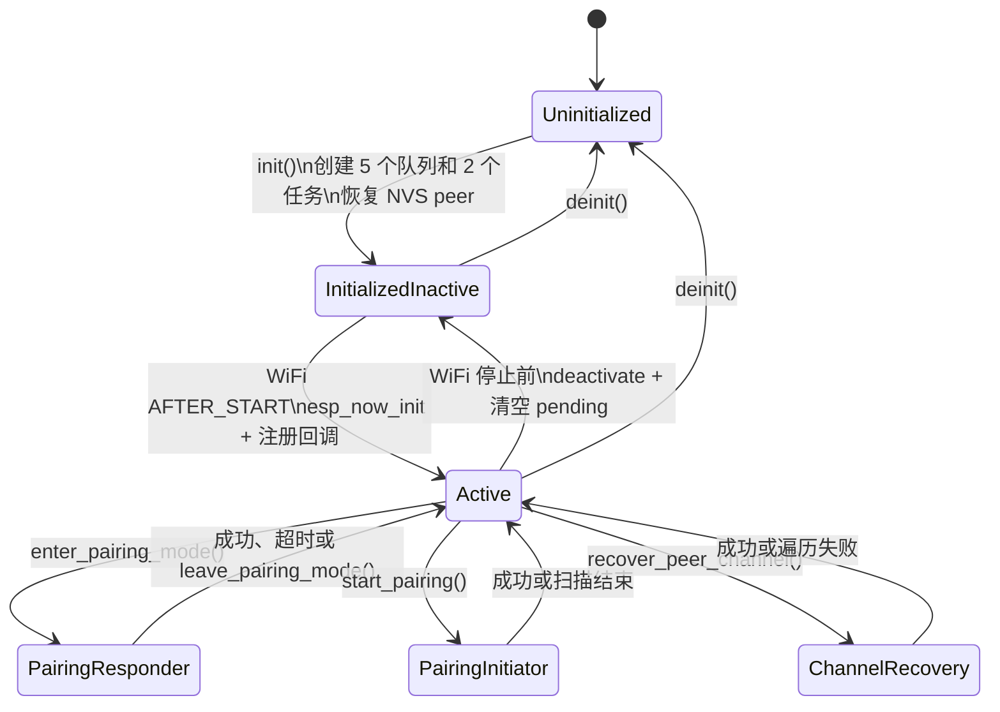

# espnow_link 模块

## 1. 模块简介

`espnow_link` 是面向通用产品的 ESP-NOW 链路层组件。它位于业务协议与
ESP-IDF `esp_now` 驱动之间，统一负责：

- ESP-NOW 随 WiFi 射频启停的生命周期管理；
- 固定格式帧的编解码、CRC32 校验和消息 ID 分发；
- 可靠单播的 ACK、超时重传、重复包抑制与序号检查；
- peer 运行期管理、LMK 加密密钥和配对结果的 NVS 持久化；
- 配对响应窗口、主动逐信道发现及配对；
- 已配对 peer 的加密信道探测与信道恢复；
- RTT 采样、自适应 ACK RTO、业务响应超时估算和链路诊断统计。

组件采用 **“WiFi 驱动回调快速入队 + 链路任务串行收发 + 配对任务独立处理状态和
NVS”** 的异步架构。业务消息格式、设备控制逻辑和硬件回调不属于本组件。

---

## 2. 核心架构与设计原理

### 2.1 模块组件关系图

`EspNowLink` 是命名空间形式的公共 API，不是需要实例化的类。内部由一个链路任务、
一个配对任务、四个链路队列和一个配对事件队列组成。



**任务与回调上下文：**

| 执行上下文 | 负责内容 | 禁止或注意事项 |
| --- | --- | --- |
| WiFi 高优先级任务 | ESP-NOW 收发回调、快速头校验、复制事件并入队 | 不做 CRC、NVS、业务处理或重传状态推进 |
| `espnow_link` 任务 | 完整验帧、ACK、重传、去重、消息分发、发送回调 | `MessageHandler` 和 `SendCallback` 在此执行，必须快速返回 |
| `espnow_pair` 任务 | 配对状态机、逐信道扫描、信道恢复、NVS 更新 | 扫描期间会等待配对事件，不应承载产品业务 |
| 业务任务 | 调用公共 API、处理自身状态 | `send()` 只表示成功入队，不表示已送达 |

### 2.2 公共类型与内部结构图



### 2.3 链路任务调度流程图

链路任务每 1 ms 执行一轮，接收事件和底层发送结果优先于新业务发送。ACK 与业务帧
共用 ESP-NOW 驱动发送通道，`driver_owner` 保证任意时刻最多只有一个底层在途帧。



### 2.4 可靠单播发送时序图



可靠包使用 `(session, sequence)` 标识。设备每次启动生成新的 `local_session_id`；
同一 session 内的重复 sequence 只补发 ACK，不重复调用业务 handler。旧于已接收序号的
包会被拒绝并计入 `sequence_errors`。

### 2.5 接收与任务间通信时序图



### 2.6 配对发起端与响应端时序图

配对发现阶段使用明文广播和明文单播；响应端生成 LMK 后，双方立即切换为加密 peer，
最终 `PAIR_CONFIRM` 必须通过可靠加密单播完成。



配对记录不保存产品角色。配对表最多保存 3 个 peer，运行期 peer 表最多容纳 7 个。

### 2.7 主动配对扫描流程图



### 2.8 信道恢复流程图

业务超时后无需重新配对。`recover_peer_channel()` 保留原 LMK，使用
`esp_now_switch_channel_tx()` 在候选信道发送加密探测。探测响应由正常接收路径进入
配对事件队列。



### 2.9 生命周期状态图



---

## 3. 协议与资源规格

### 3.1 链路帧格式

所有多字节整数按小端序编码，最大 ESP-NOW 帧为 250 字节。

| 偏移 | 大小 | 字段 | 说明 |
| --- | ---: | --- | --- |
| 0 | 2 | `magic` | 固定 `0x5848` |
| 2 | 1 | `version` | 当前为 `1` |
| 3 | 1 | `flags` | bit0=`RELIABLE`，bit1=`ACK` |
| 4 | 2 | `message_id` | `0` 保留给链路 ACK |
| 6 | 2 | `payload_size` | 最大 224 字节 |
| 8 | 4 | `sequence` | 业务序号；ACK 中承载发送端 session |
| 12 | 4 | `correlation` | 业务帧承载 session；ACK 中承载被确认 sequence |
| 16 | 4 | `crc32` | 覆盖前 16 字节和 payload |
| 20 | 0~224 | `payload` | 业务数据 |

### 3.2 固定资源

| 资源 | 数量/大小 | 用途 |
| --- | ---: | --- |
| `rx_queue` | 16 | 驱动接收回调到链路任务 |
| `tx_queue` | 16 | 业务任务到链路任务 |
| `mac_queue` | 8 | 驱动发送完成回调到链路任务 |
| `ack_queue` | 8 | 接收处理到 ACK 发送器 |
| pairing `event_queue` | 12 | 链路任务/公共 API 到配对任务 |
| handler 表 | 16 | `message_id` 到回调的映射 |
| 运行期 peer 表 | 7 | 当前 RAM 中的 peer 和 RTT/去重状态 |
| NVS peer 表 | 3 | 持久化 MAC、LMK、最后信道 |
| 最大 payload | 224 字节 | 250 - 20 字节帧头，预留驱动限制 |

---

## 4. 标准使用指南

### 4.1 初始化

必须先初始化并启动 `WiFiManager`。如果 WiFi 已启动，`init()` 会立即激活 ESP-NOW；
否则等待 `AFTER_START` 事件。WiFi 停止时组件自动反初始化 ESP-NOW，重新启动后自动恢复
广播 peer 和已加载的单播 peer。

```cpp
#include "espnow_link.h"

void app_main() {
    ESP_ERROR_CHECK(EspNowLink::init());
}
```

### 4.2 注册业务消息处理函数

```cpp
constexpr uint16_t MSG_SWITCH_EVENT = 0x2001;

static void on_switch_event(const EspNowLink::Message& message, void* context) {
    // payload 只在本次回调返回前有效；需要异步处理时必须自行复制。
    // 此回调运行在 espnow_link 任务中，避免阻塞、长日志和等待其他任务。
}

ESP_ERROR_CHECK(EspNowLink::register_handler(
    MSG_SWITCH_EVENT, on_switch_event, nullptr));
```

同一个 `message_id` 再次注册会更新 handler。`message_id == 0` 为 ACK 保留，不能注册。

### 4.3 可靠单播

```cpp
static void on_sent(EspNowLink::SendResult result,
                    uint32_t sequence,
                    void* context) {
    // 回调运行在 espnow_link 任务中。
}

uint8_t payload[] = {0x01, 0x00};
EspNowLink::SendOptions options = {};
options.delivery = EspNowLink::Delivery::RELIABLE;
options.timeout_mode = EspNowLink::TimeoutMode::ADAPTIVE;
options.max_attempts = 5; // 包含首次发送

esp_err_t ret = EspNowLink::send(peer_address,
                                 0x2002,
                                 payload,
                                 sizeof(payload),
                                 options,
                                 on_sent,
                                 nullptr);
```

`send()` 返回值只描述参数检查和队列操作：

- `ESP_OK`：请求已复制进 `tx_queue`；
- `ESP_ERR_INVALID_STATE`：链路未激活，或明文单播未显式授权；
- `ESP_ERR_NOT_FOUND`：单播 peer 不存在；
- `ESP_ERR_NO_MEM`：发送队列已满；
- `ESP_ERR_INVALID_ARG`：payload 超限、空指针或使用了保留消息 ID。

最终结果由 `SendCallback` 返回：

- `ACKNOWLEDGED`：可靠包收到匹配 ACK；
- `SENT`：BEST_EFFORT 的 MAC 层发送成功；
- `NO_ACK`：可靠包达到最大尝试次数；
- `SUBMIT_FAILED`：编码或提交驱动失败；
- `MAC_FAILED`：BEST_EFFORT 的 MAC 层发送失败。

### 4.4 广播

广播会被组件强制转换为明文 `BEST_EFFORT`，不存在端到端 ACK。

```cpp
EspNowLink::SendOptions options = {};
options.delivery = EspNowLink::Delivery::BEST_EFFORT;

EspNowLink::send(EspNowLink::BROADCAST_ADDRESS,
                 0x2003,
                 payload,
                 sizeof(payload),
                 options);
```

### 4.5 配对

设备允许其他节点向本机发起配对：

```cpp
ESP_ERROR_CHECK(EspNowLink::init());
ESP_ERROR_CHECK(EspNowLink::enter_pairing_mode(60000));

// 0 表示持续到成功配对或显式调用 leave_pairing_mode()。
// EspNowLink::enter_pairing_mode(0);
```

设备主动逐信道扫描并发起配对：

```cpp
ESP_ERROR_CHECK(EspNowLink::init());
ESP_ERROR_CHECK(EspNowLink::start_pairing());
```

链路层不定义主从或产品角色。同一设备可以在不同时间调用上述任一流程，但响应窗口与
主动扫描不能同时运行。

### 4.6 信道恢复

```cpp
ESP_ERROR_CHECK(EspNowLink::recover_peer_channel(peer_address));

while (EspNowLink::is_recovering_channel()) {
    vTaskDelay(pdMS_TO_TICKS(10));
}

esp_err_t result = EspNowLink::get_channel_recovery_result();
```

恢复操作与主动配对不能并行。成功后会同时更新当前 WiFi 信道、运行期 peer 和 NVS 中的
`last_channel`。

---

## 5. 超时、RTT 与诊断

### 5.1 ACK RTO

可靠发送的超时选择顺序为：

1. 本次 `SendOptions.ack_timeout_ms`；
2. `ADAPTIVE` 模式下该 peer 的自适应 RTO；
3. 全局默认 RTO。

首次有效 ACK 的 RTT 会更新平滑 RTT：

```text
smoothed_rtt = (7 * old_smoothed_rtt + new_rtt) / 8
ack_timeout  = clamp(smoothed_rtt + 5 ms, 8 ms, 100 ms)
```

发生过重传的请求不采样 RTT，避免 ACK 来源不明确导致估算失真。重传使用固定 RTO，
不做指数退避。

### 5.2 业务等待时间

业务层不要使用固定长超时，应按 peer 当前 RTO 计算：

```cpp
uint32_t response_timeout =
    EspNowLink::get_response_timeout_ms(peer_address,
                                        5,   // 请求最大尝试次数
                                        5,   // 响应最大尝试次数
                                        30); // 对端业务处理预算

uint32_t delivery_timeout =
    EspNowLink::get_delivery_timeout_ms(peer_address, 5, 250);
```

### 5.3 诊断统计

```cpp
EspNowLink::LinkStatistics stats = {};
EspNowLink::get_statistics(&stats);

// 重点关注：
// stats.rx_queue_overflows  驱动接收速度超过链路任务处理能力
// stats.tx_submit_errors   发送队列/ACK 队列或驱动提交失败
// stats.tx_mac_failures    MAC 层发送失败
// stats.ack_timeouts       可靠发送耗尽重试
// stats.rx_duplicates      对端因 ACK 丢失而重发，已被正确去重
// stats.sequence_errors    收到同 session 的旧序号
// stats.timing_errors      迟到或不符合当前状态的 ACK
```

`get_statistics()` 返回线程安全快照；`reset_statistics()` 只清零本次运行计数，不修改
peer、RTT、队列和发送状态。

---

## 6. 重要约束

1. 广播只能是明文 `BEST_EFFORT`，不能提供唯一对端 ACK。
2. 普通单播必须先存在 peer；未加密 peer 只允许配对协议显式设置
   `allow_plaintext = true`。
3. 整个组件最多有一个业务 `PendingTransmission`，ACK 与业务帧也串行占用底层驱动。
4. `MessageHandler` 和 `SendCallback` 都在 `espnow_link` 任务中执行，必须快速返回。
5. `Message.payload` 指向接收队列事件内部缓冲，只在 handler 返回前有效。
6. 接收回调和发送回调运行在 WiFi 高优先级任务中，只允许非阻塞入队。
7. 配对任务负责 NVS 操作；链路 handler 只解析配对 payload 并投递 `PairEvent`。
8. NVS 使用固定 key `now_peers`，LMK 不通过公共查询 API 暴露。
9. `deinit()` 释放链路任务和四个链路队列；当前实现未销毁配对任务及其事件队列，
   组件设计用途是进程生命周期内初始化一次。

---

## 7. 文件结构与职责

```text
espnow_link/
├── include/
│   └── espnow_link.h              # 公共类型和 API
├── private_include/
│   ├── espnow_link_internal.h     # 链路队列、peer、pending 等内部状态
│   ├── espnow_pairing_internal.h  # 配对事件、持久化结构和内部接口
│   └── espnow_protocol.h          # 链路帧格式与编解码接口
└── src/
    ├── espnow_link.cpp            # 生命周期、WiFi 回调、队列和任务创建
    ├── espnow_link_api.cpp        # peer、发送、handler、超时和统计 API
    ├── espnow_link_task.cpp       # ACK、重传、去重、分发和链路任务
    ├── espnow_protocol.cpp        # 帧编解码、快速校验和 CRC32
    ├── espnow_pairing.cpp         # 配对任务、扫描与信道恢复状态机
    ├── espnow_pairing_protocol.cpp# 配对 payload 编解码
    └── espnow_peer_store.cpp      # NVS peer 表校验、读写和恢复
```

## 8. 依赖

- ESP-IDF v6.0+
- `esp_wifi` / `esp_now`
- `wifi_manager`
- `HXC_NVS`
- FreeRTOS
